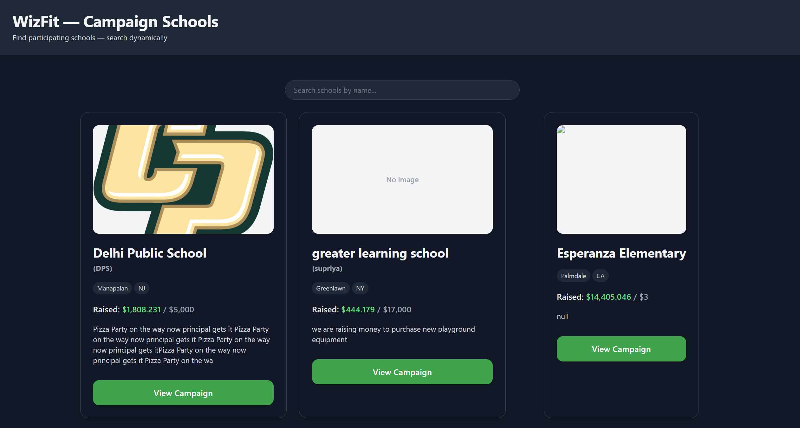

# WizFit Campaign Schools Frontend

A responsive Vue 3 application that fetches and displays a list of schools participating in the WizFit Challenge campaign. Users can search schools dynamically, view details, and enjoy a smooth, optimized frontend experience.

---

## Table of Contents

- [Demo](#demo)
- [Features](#features)
- [Tech Stack](#tech-stack)
- [Setup & Installation](#setup--installation)
- [Usage](#usage)
- [API Integration](#api-integration)
- [Search & Pagination](#search--pagination)
- [Error Handling](#error-handling)
- [Optimization](#optimization)
- [Testing](#testing)
- [Deployment](#deployment)
- [License](#license)

---

## Demo



---

## Features

- Fetch schools from the WizFit Challenge API.
- Dynamic search with debounced input to reduce API calls.
- Responsive card-based layout for all screen sizes.
- Lazy-loaded images for performance.
- Graceful handling of empty results and errors.
- Simple caching of API results (2-minute TTL).
- Optional "Load More" pagination for larger datasets.

---

## Tech Stack

- **Frontend:** Vue 3 (Composition API)
- **Bundler:** Vite
- **HTTP Client:** Axios
- **Utilities:** lodash.debounce
- **Styling:**Tailwind CSS

---

## Setup & Installation

```bash
# Clone the repository
git clone <repo-url>
cd wizfit-schools

# Install dependencies
npm install

# Run development server
npm run dev

# Build production bundle
npm run build
```
